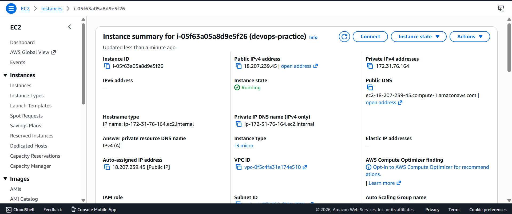
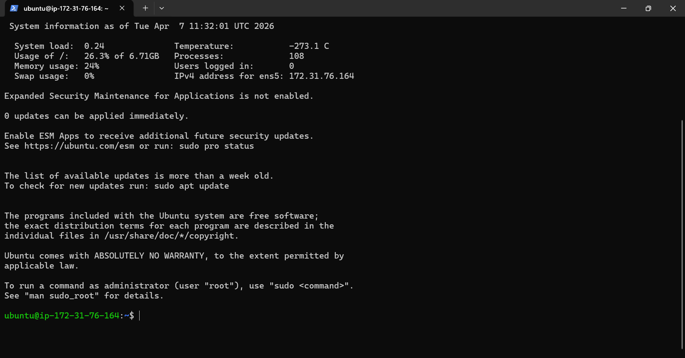
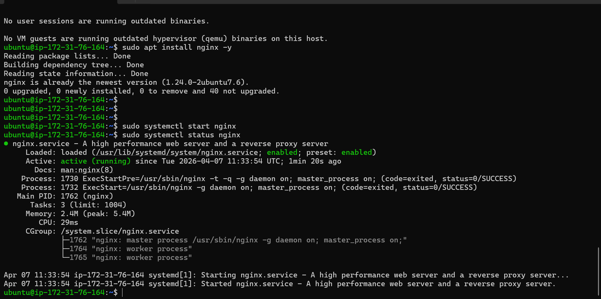
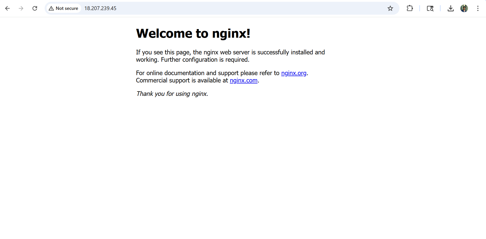
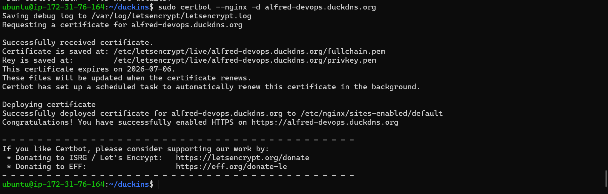
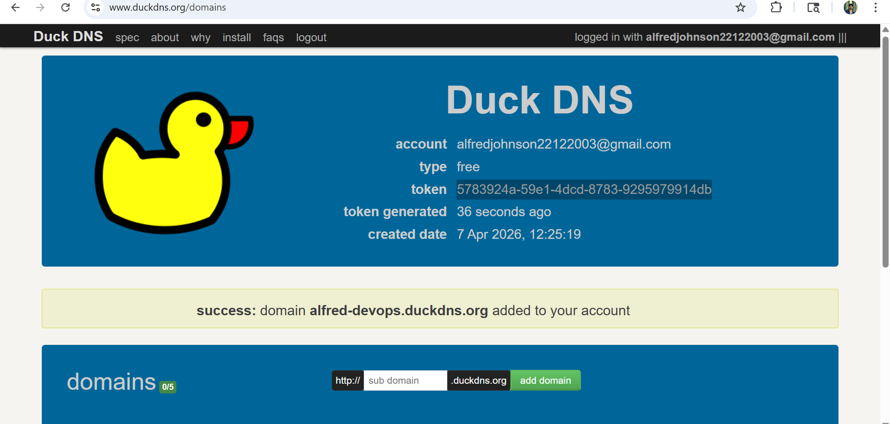
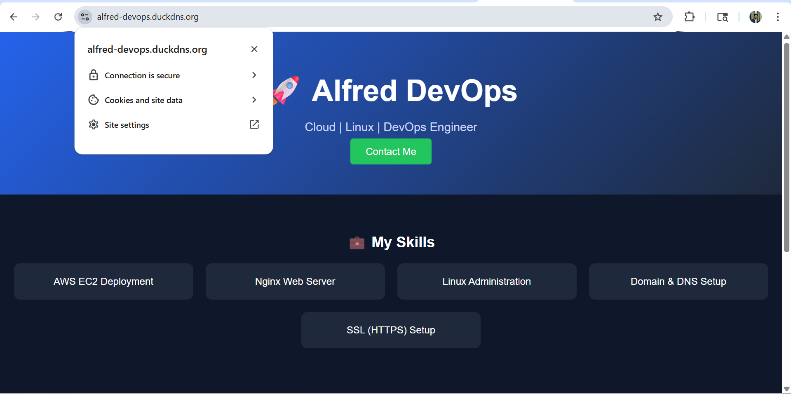

# 🚀 Production-Ready Website Deployment on AWS EC2 with Nginx, Domain & HTTPS

## 📌 Project Overview
This project demonstrates an end-to-end deployment of a static website on a cloud server using AWS EC2, configured with a custom domain and secured with HTTPS.

---

## 🛠️ Technologies Used
- AWS EC2
- Ubuntu
- Nginx
- SSH
- DuckDNS (Free Domain)
- Let's Encrypt (SSL)

---

## 🏗️ Architecture

User → Domain (DuckDNS) → AWS EC2 → Nginx → Static Website

- Domain mapped to EC2 public IP
- Nginx serves website on port 80
- HTTPS enabled on port 443 using SSL

---

## 🚀 Steps Performed

1. Created EC2 instance on AWS
2. Connected to server using SSH
3. Installed and configured Nginx
4. Deployed a static HTML website
5. Configured domain using DuckDNS
6. Enabled HTTPS using Let's Encrypt
7. Verified secure website deployment

---

## 🌐 Live Demo

⚠️ The EC2 instance was stopped to avoid AWS charges.

The project was successfully deployed and tested using:

🔗 http://alfred-devops.duckdns.org

Refer to screenshots below for proof of successful deployment.

---

## 📸 Screenshots

### 1. EC2 Instance Running

### 2. SSH Connection

### 3. Nginx Running Status

### 4. HTTP Working

### 5. Certbot Success

### 6. DuckDNS Setup

### 7. Final Website with HTTPS 🔒

---

## 🔐 Security Configuration

- Opened ports:
  - 22 (SSH)
  - 80 (HTTP)
  - 443 (HTTPS)
- Configured firewall rules using EC2 Security Groups
- Enabled SSL encryption using Let's Encrypt
- Automatic SSL renewal configured via Certbot

---

## 🔒 HTTPS Configuration

SSL certificate configured using Let's Encrypt.

- Secure HTTPS enabled
- Auto-renewal enabled
- Certificate validity verified

---

## 🧠 Key Learnings

- Cloud server provisioning using AWS
- Linux server management
- Nginx configuration
- Domain and DNS setup
- SSL/HTTPS implementation
- Real-world deployment workflow

---

## 💰 Cost Optimization

- Used AWS Free Tier
- Stopped instance after use
- Avoided unnecessary charges

---

## 🚀 Future Improvements

- Use Elastic IP for permanent hosting
- Configure Load Balancer for scalability
- Automate deployment using CI/CD pipelines
- Deploy dynamic applications (Node.js, React)

---

## 📌 Conclusion

This project demonstrates a complete end-to-end deployment of a secure website on the cloud using industry-standard tools and practices, forming a strong foundation in DevOps and cloud engineering.
